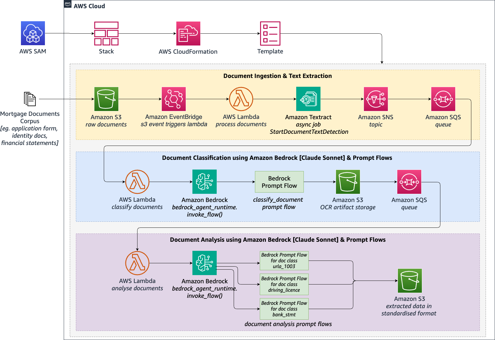

# Automate document processing with Amazon Bedrock Prompt Flows

This repository contains sample code and templates for building an automated document processing pipeline using Amazon Bedrock Prompt Flows, Amazon Textract, and other AWS services. The solution demonstrates how to extract text from documents, classify them, and perform custom analysis using large language models in a scalable, serverless architecture.

# Solution Architecture


## Deployment Instructions

1. Clone this repository
2. Install prerequisites:
   - AWS CLI
   - AWS SAM CLI  
3. Make sure you have enabled access to Anthropic Claude 3 Sonnet on Amazon Bedrock
4. Deploy the solution:

```bash
chmod +x deploy.sh
./deploy.sh
```

4. Follow the prompts to complete deployment

## Testing

1. Upload sample documents to the created S3 source bucket:

```bash
aws s3 sync ./sample_files/customer123 s3://[SourceS3Bucket_NAME]/customer123
```

2. Download results from the destination S3 bucket after a few minutes to inspect the output files

```bash
aws s3 sync s3://[DestinationS3Bucket_NAME]/customer123 ./result_files/customer123 
```


## Cleanup

To remove all created resources:

1. S3 buckets have versioning enabled. [Empty](https://docs.aws.amazon.com/AmazonS3/latest/userguide/empty-bucket.html) the SourceS3Bucket and DestinationS3Bucket buckets including all versions

2. Run the cleanup script

```bash
chmod +x cleanup.sh
./cleanup.sh
```


## Expanding the Solution

Refer to the full blog post for instructions on adding new document types and analysis flows using Amazon Bedrock Prompt Flows.


## Security

See [CONTRIBUTING](CONTRIBUTING.md#security-issue-notifications) for more information.

## License

This library is licensed under the MIT-0 License. See the LICENSE file.

